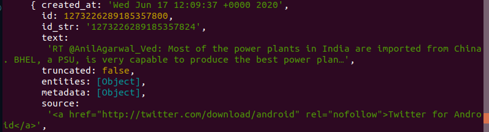

# Creating a twitter bot in javascript
## With the coding train

1. Install node js
2. npm install twit
3. generate twiiter api keys
4. using a seperate config file to get the config information.
5. Basic search : 

## Building blocks of twitter api

1. get() function - use dto search by hashtag, location or user
2. post() function - done for tweeting
3. stram() function - ???? and  @mention
